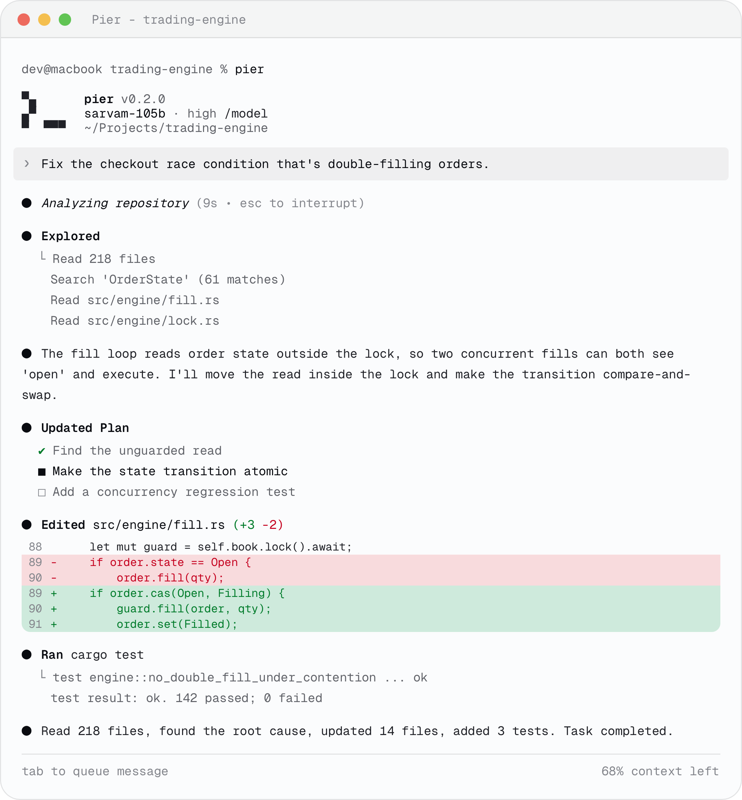

<p align="center">
  <picture>
    <source media="(prefers-color-scheme: dark)" srcset="./pier-dark-icon.svg" />
    <source media="(prefers-color-scheme: light)" srcset="./pier-light-icon.svg" />
    
  </picture>
</p>

<h1 align="center">Pier</h1>

<p align="center">Pier is an agentic coding tool that lives in your terminal. It understands your repository, edits across files, and ships — all through natural language. <strong>AI for all, from Bharat.</strong></p>

<p align="center"><strong>Learn more at <a href="https://www.piercode.com">www.piercode.com</a>.</strong></p>

<p align="center"></p>

## Get started

1. Install Pier (macOS and Linux):

    ```bash
    curl -fsSL https://dl.piercode.com/install.sh | sh
    ```

    The script detects your OS and architecture (macOS on Apple Silicon or Intel; Linux on x86_64 or arm64), installs the `pier` binary to `~/.pier/bin`, and adds it to your `PATH`. To pin a specific version:

    ```bash
    curl -fsSL https://dl.piercode.com/install.sh | sh -s -- --release 0.1.11
    ```

    See [docs/install.md](./docs/install.md) for platform support, environment variables, and uninstall steps.

2. Sign in:

    ```bash
    pier login
    ```

3. Navigate to your project directory and run `pier`.

## Documentation

- [Getting started](./docs/getting-started.md) — your first session
- [Install](./docs/install.md) — platforms, options, uninstall
- [Configuration](./docs/configuration.md) — models, approvals, sandbox
- [Slash commands](./docs/slash-commands.md) — in-session commands
- [Languages](./docs/languages.md) — prompting in Indian languages
- [Pricing](./docs/pricing.md) — Pro & Max plans and usage packs
- [FAQ](./docs/faq.md) — common questions

## Pricing

Pier runs on **sovereign Indian models**, trained and hosted in Bharat. **Pro** is **$5/month** — the full agent, multi-repo context, Indian-language prompting, and a monthly pool of usage credits. Need more headroom? **Max** is **$20/month** with a much larger credit pool. Out of credits on either plan? Add a **$5 usage pack** any time; packs stack and credits never expire. See [docs/pricing.md](./docs/pricing.md).

## Reporting bugs

We welcome your feedback. File a [GitHub issue](https://github.com/alphabench/pier/issues) or email [hello@piercode.com](mailto:hello@piercode.com).

## Privacy

Pier runs locally as a single binary. In local-only mode your code never leaves your machine; cloud model calls are opt-in and clearly indicated before they run. We do not retain your source code on our servers, and prompts are never used to train models. See the [security](https://www.piercode.com/security) and [privacy](https://www.piercode.com/privacy) pages for full details.

---

© Alphabench. All rights reserved. See [LICENSE.md](./LICENSE.md).
